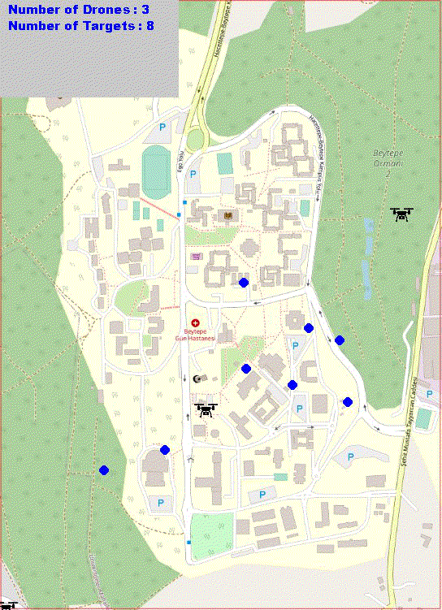
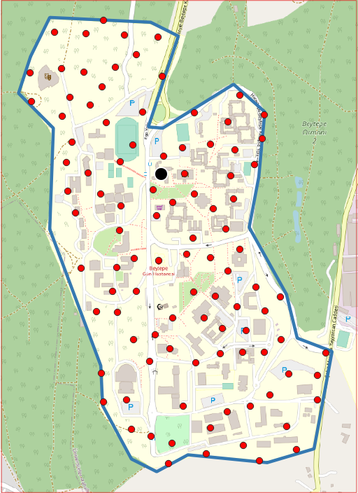
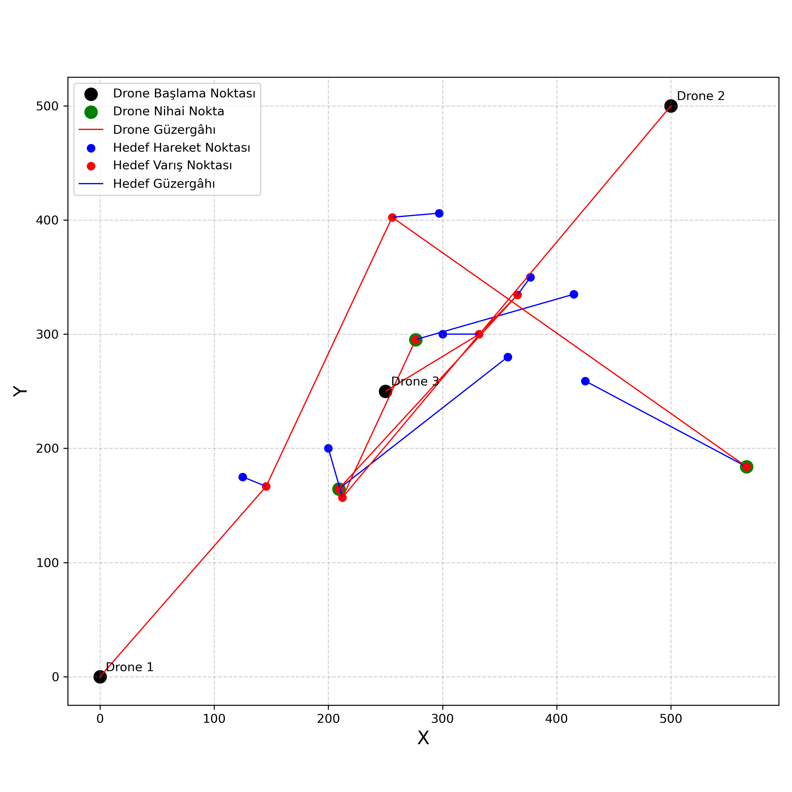
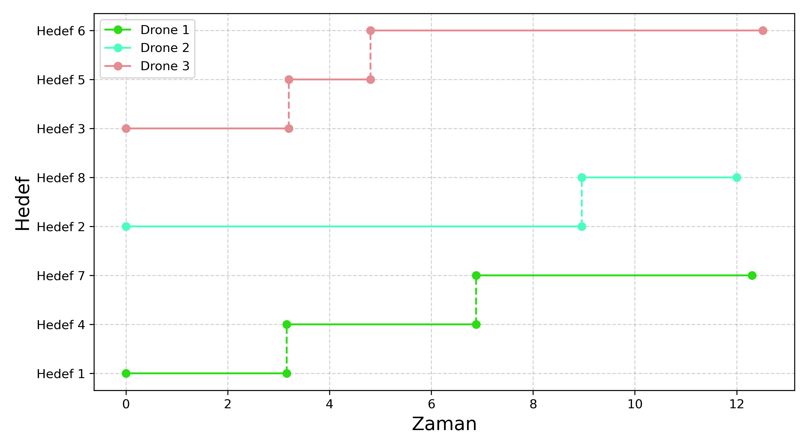

# DRONE SİMULASYONU UYGULAMASI

<table>
  <tr>
    <td><strong>Hareketli Hedef (1)</strong></td>
    <td><strong>Sabit Hedef (2)</strong></td>
    <td><strong>Hareketli Hedef + Final Durak (3)</strong></td>
   </tr>
  <tr>
    <td></td>
    <td></td>    
    <td></td>
  </tr>
</table>

Bu uygulanma kullanılarak belirli hedeflere Drone'lar tarafından ulaşılması simüle edilmektedir. Çalışmada gerekli olan veriler "veriler" klasörü altında bulunmaktadır. Uygulama 3 aşamadan oluşmaktadır. Bunlar; "Güzergah Analizi", "Sonuçların Görselleştirilmesi" ve "Simülasyonun Çalıştırılması". Ayrıca; girdi verilerinin hazırlanmasına yardımcı olabilecek "Rastgele Nokta Oluşturma" imkanı da vardır. Bahsi geçen çalışmalar aşağıda anlatılmıştır.

### 1-) Rastgele Nokta Oluşturma
- `rastgele_nokta_olusturma.py` dosyası kullanılarak gerçekleştirilir,
- "veriler" klasöründeki `data.xlsx` dosyasının `RandomTarget` ve `RandomDrone` sayfalarındaki girdiler kullanılarak rastgele drone ve hedef oluşturulur,
- Sonuçlar "sonuclar" klasörüne `random_data.xlsx` ismi ile kaydedilir. (Kayıt yeri ve dosya isminin değiştirilmesi için `rastgele_nokta_olusturma.py` dosyası içerisinden gerekli ayarlamalar yapılabilir.)

### 2-) Çalışma Alanında Rastgele Nokta Oluşturma
- Rastgele Dosya Oluşturma işlemine benzerdir. Oluşacak hedef ve Drone'lara rastgele koordinatlar atamak yerine; "veriler" klasöründe, `sim_boundary.gpkg` dosyasında bulunan ve QGIS yazılımı kullanılarak Beytepe kampüsü sınırları içerisinde daha önce oluşturulan 100 adet hedef baz alınır,
- 100 adet hedef (aşağıdaki görselde kırmızı noktalar) rastgele dağıtılmış olup Drone'ların (aşağıdaki görselde siyah nokta) tek bir noktadan dağıldığı varsayılarak tek bir Drone noktası oluştutulmuştur ve oluşturulan tüm Drone'ların koordinatı bu noktadır,
- İşlem `calisma_alaninda_rastgele_nokta_olusturma.py` dosyası kullanılarak gerçekleştirilir,
- "veriler" klasöründeki `data.xlsx` dosyasının `RandomTarget` ve `RandomDrone` sayfalarındaki girdiler kullanılarak oluşturulur,
- `sim_boundary.gpkg` dosyasındaki "Drone" ve "Hedef" koordinatlarını gösteren noktalar değiştirilebilir,
- Sonuçlar "sonuclar" klasörüne `random_data_beytepe.xlsx` ismi ile kaydedilir. (Kayıt yeri ve dosya isminin değiştirilmesi için `calisma_alaninda_rastgele_nokta_olusturma.py` dosyası içerisinden gerekli ayarlamalar yapılabilir.)

<td>

### 3-) Drone Güzergahı Analizi
- İşlem `drone_guzergah_analizi.py` dosyası kullanılarak gerçekleştirilir,
- Drone'ların hedeflere ulaşması için uçuş planı hazırlanması için gereklidir,
- "veriler" klasöründeki `data.xlsx` dosyasının `Operator` ve `Target` sayfalarındaki girdiler kullanılarak oluşturulur,
- Sonuçlar "sonuclar" klasörüne `results.csv` ve `results.xlsx` isimleri ile kaydedilir,
- Drone hedefe ulaştıktan sonra hedefin belirli bir koordinata gitmesi isteniyorsa (yukarıdaki 3 no.lu gif) `drone_guzergah_analizi.py` dosyasındaki `RETURN_COORS` değişkenine koordinat değerleri girilebilir,

### 4-) Güzergaha Ait Çizimler
- İşlem `cizimler.py` dosyası kullanılarak gerçekleştirilir,
- Drone Güzergahı Analizi ile oluşturulan plana ait iki adet görsel oluşturulur,
- Birinci görsel Drone'ların ve hedeflerin hareket güzrgahını (aşağıdaki 1 no.lu görsel) gösteren bir grafik olup ikincisi ise Drone'ların hedeflere ulaşma sürelerini aşağıdaki 2 no.lu görsel gösteren bir grafiktir.
- Grafikler "sonuclar" klasörüne `drone_routes.png` ve `drone_timing.png` isimleriyle kaydedilir.
  
<table>
  <tr>
    <td><strong>Drone ve Hedef Güzergahları (1)</strong></td>
    <td><strong>Drone'ların Hedeflere Ulaşma Süreleri (2)</strong></td>
   </tr>
  <tr>
    <td></td>
    <td></td>    
  </tr>
</table>

### 5-) Simulasyon
- `simulasyon.py` dosyası kullanılarak gerçekleştirilir,
- Güzergah planı oluşturulduktan sonra bu uçuşun hareketli bir şekilde görselleştirilmesi için kullanılır,
- Simülasyon hızı `simulasyon.py` dosyası içerisinden `SPEED_RATIO` değişkeni ile ayarlanabilir. Ayrıca; Drone hedefe ulaşıldıktan sonra istenilen bir koordinata (Drone Güzergahı Analizi'nde `RETURN_COORS` değişkenine atanan değerde belirtilen koordinata) gitmesi isteniyorsa `simulasyon.py` dosyası içerisinde `RETURN_TO_CENTER` seçeneği `True` yapılmalıdır.
- Simülasyon ekranının çözünürlüğü `SCREEN_WIDTH` ve `SCREEN_HEIGHT` değişkenleri ile ayarlanabilir.
  
